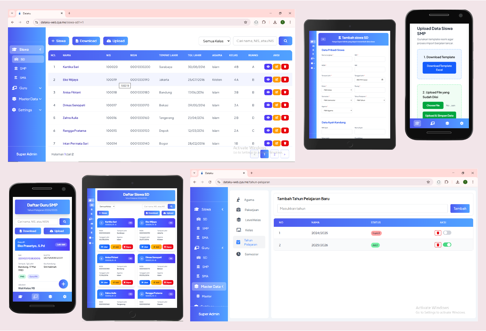

# mydata

## Requirements

- PHP (with Composer)
- Node.js & npm
- Web server (Apache/Nginx) or PHP built-in server

---

## Installation & Setup

### 1. Clone Repository

```sh
git clone https://github.com/haetamm/mydata.git
cd mydata
```

---

### 2. Install Dependencies

**Install PHP dependencies (Composer):**

```sh
composer install
composer dump-autoload
```

**Install Node.js dependencies:**

```sh
npm install
```

---

### 3. Build Frontend Assets

Jalankan perintah berikut untuk menyalin package JS/CSS ke folder `assets/` dan build Tailwind CSS:

```sh
npm run build
```

> Perintah ini akan:
>
> - Menyalin `cash.min.js` → `assets/js/`
> - Menyalin `sweetalert2.min.css` → `assets/css/` dan `sweetalert2.all.min.js` → `assets/js/`
> - Meng-compile dan minify Tailwind CSS → `assets/css/output.css`

Untuk mode development (watch otomatis saat ada perubahan CSS):

```sh
npm run dev
```

---

### 4. Project Setup

Edit kredensial database di file `lib/connection.php`:

```php
$host     = 'localhost';
$dbname   = 'nama_database';
$username = 'root';
$password = '';
```

---

### 5. Migrate Database

Akses migration script melalui browser:

```
http://localhost:<port>/mydata/generate.php
```

---

### 6. Run Application

Buka aplikasi di browser:

```
http://localhost:<port>/mydata
```

---

## Screenshot

<div align="center">
  
</div>

---

## Tech Stack

- **PHP** — Backend & server-side logic
- **Composer packages:** `rakit/validation`, `phpoffice/phpspreadsheet`
- **Tailwind CSS** — Utility-first CSS framework
- **cash-dom** — Lightweight jQuery alternative
- **SweetAlert2** — Beautiful alert dialogs

---

## License

ISC
